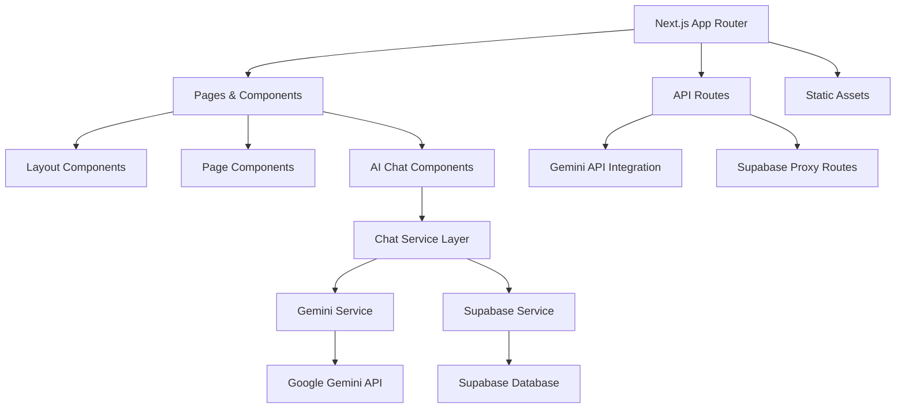

# Design Document

## Overview

This design outlines the migration of a cybersecurity website from static HTML to a modern Next.js application. The current site features multiple HTML pages, an AI chat interface with Gemini API integration, Supabase authentication, and comprehensive styling using Tailwind CSS and Alpine.js. The migration will preserve all functionality while modernizing the architecture for better performance, maintainability, and developer experience.

## Architecture

### High-Level Architecture



### Technology Stack

**Frontend:**
- Next.js 14+ with App Router
- React 18+
- TypeScript for type safety
- Tailwind CSS for styling
- Framer Motion for animations (replacing Alpine.js)

**Backend:**
- Next.js API Routes
- Supabase for authentication and database
- Google Gemini API for AI functionality

**Development:**
- ESLint and Prettier for code quality
- Husky for git hooks
- Next.js built-in optimization features

## Components and Interfaces

### Core Layout Structure

```
app/
├── layout.tsx                 # Root layout with navigation
├── page.tsx                   # Home page
├── globals.css               # Global styles
├── components/
│   ├── ui/                   # Reusable UI components
│   │   ├── Navigation.tsx
│   │   ├── Footer.tsx
│   │   ├── Button.tsx
│   │   └── Modal.tsx
│   ├── layout/
│   │   ├── Header.tsx
│   │   └── Sidebar.tsx
│   └── ai-chat/              # AI chat components
│       ├── ChatInterface.tsx
│       ├── MessageList.tsx
│       ├── MessageInput.tsx
│       ├── ChatHistory.tsx
│       └── AuthModal.tsx
├── services/                 # Service pages
│   ├── page.tsx
│   ├── threat-detection/
│   ├── network-security/
│   └── [service]/page.tsx
├── blog/                     # Blog pages
│   ├── page.tsx
│   └── [slug]/page.tsx
├── about/
│   ├── our-team/page.tsx
│   ├── our-mission/page.tsx
│   └── our-clients/page.tsx
├── ai-chat/                  # AI chat application
│   └── page.tsx
└── api/                      # API routes
    ├── chat/
    │   ├── route.ts
    │   └── history/route.ts
    ├── auth/
    │   └── route.ts
    └── gemini/
        └── route.ts
```

### Component Interfaces

#### Navigation Component
```typescript
interface NavigationProps {
  currentPath: string;
}

interface DropdownItem {
  label: string;
  href: string;
  children?: DropdownItem[];
}
```

#### AI Chat Components
```typescript
interface Message {
  id: string;
  content: string;
  sender: 'user' | 'ai';
  timestamp: number;
}

interface ChatSession {
  id: string;
  title: string;
  messages: Message[];
  lastUpdated: number;
  preview: string;
}

interface ChatInterfaceProps {
  initialSession?: ChatSession;
}
```

#### Service Layer Interfaces
```typescript
interface GeminiService {
  generateResponse(message: string, history: Message[]): Promise<string>;
  generateResponseWithImage(message: string, imageData: ImageData): Promise<string>;
}

interface SupabaseService {
  saveChat(chatData: ChatSession): Promise<{ success: boolean; error?: string }>;
  loadChats(): Promise<{ success: boolean; chats: ChatSession[] }>;
  deleteChat(chatId: string): Promise<{ success: boolean }>;
  signIn(email: string, password: string): Promise<AuthResult>;
  signUp(email: string, password: string): Promise<AuthResult>;
}
```

## Data Models

### Chat Data Structure
```typescript
interface ChatSession {
  id: string;
  title: string;
  messages: Message[];
  lastUpdated: number;
  preview: string;
  userId?: string;
}

interface Message {
  id: string;
  content: string;
  sender: 'user' | 'ai';
  timestamp: number;
  attachments?: FileAttachment[];
}

interface FileAttachment {
  id: string;
  name: string;
  type: string;
  size: number;
  url: string;
}
```

### User Authentication
```typescript
interface User {
  id: string;
  email: string;
  name?: string;
  avatar?: string;
  createdAt: Date;
}

interface AuthResult {
  success: boolean;
  user?: User;
  error?: string;
}
```

### Page Content Structure
```typescript
interface PageContent {
  title: string;
  description: string;
  content: string;
  seo: {
    metaTitle: string;
    metaDescription: string;
    keywords: string[];
  };
}

interface ServicePage extends PageContent {
  icon: string;
  features: string[];
  benefits: string[];
}

interface BlogPost extends PageContent {
  slug: string;
  author: string;
  publishedAt: Date;
  tags: string[];
  featuredImage?: string;
}
```

## Error Handling

### Client-Side Error Handling

**AI Chat Errors:**
- Network connectivity issues with Gemini API
- Authentication failures with Supabase
- File upload errors
- Chat history loading failures

**Error Boundary Implementation:**
```typescript
interface ErrorBoundaryState {
  hasError: boolean;
  error?: Error;
}

class ChatErrorBoundary extends React.Component<Props, ErrorBoundaryState> {
  // Handle AI chat specific errors
  // Provide fallback UI
  // Log errors for monitoring
}
```

**Fallback Strategies:**
- Local storage fallback for chat history when Supabase is unavailable
- Retry mechanisms for API calls
- Graceful degradation for non-critical features

### Server-Side Error Handling

**API Route Error Handling:**
```typescript
interface APIError {
  code: string;
  message: string;
  details?: any;
}

interface APIResponse<T> {
  success: boolean;
  data?: T;
  error?: APIError;
}
```

**Error Types:**
- Authentication errors (401, 403)
- Rate limiting errors (429)
- External API failures (Gemini, Supabase)
- Validation errors (400)
- Server errors (500)

## Testing Strategy

### Unit Testing
- **Components:** React Testing Library for UI components
- **Services:** Jest for service layer testing
- **Utilities:** Jest for helper functions
- **API Routes:** Supertest for API endpoint testing

### Integration Testing
- **AI Chat Flow:** End-to-end chat functionality
- **Authentication:** Login/logout flows
- **File Upload:** Image and document processing
- **Navigation:** Page routing and navigation

### E2E Testing
- **Playwright:** For critical user journeys
- **Test Scenarios:**
  - Complete chat session from start to finish
  - User registration and authentication
  - Page navigation and content loading
  - Mobile responsiveness

### Performance Testing
- **Lighthouse:** Core Web Vitals monitoring
- **Bundle Analysis:** Code splitting effectiveness
- **Load Testing:** API route performance under load

## Migration Strategy

### Phase 1: Project Setup and Core Infrastructure
1. Initialize Next.js project with TypeScript
2. Set up Tailwind CSS and basic styling
3. Create project structure and core components
4. Set up development tools (ESLint, Prettier, Husky)

### Phase 2: Static Page Migration
1. Convert HTML pages to Next.js pages
2. Extract reusable components (Navigation, Footer, etc.)
3. Implement responsive design with Tailwind
4. Set up proper SEO metadata

### Phase 3: AI Chat Migration
1. Convert AI chat functionality to React components
2. Migrate service layer (Gemini and Supabase services)
3. Implement authentication system
4. Set up API routes for chat functionality

### Phase 4: Advanced Features and Optimization
1. Implement file upload functionality
2. Add animations and interactions
3. Optimize performance (images, code splitting)
4. Set up monitoring and error tracking

### Phase 5: Testing and Deployment
1. Comprehensive testing suite
2. Performance optimization
3. Deployment configuration
4. Documentation and handover

## Performance Considerations

### Next.js Optimizations
- **Image Optimization:** Use Next.js Image component for all images
- **Code Splitting:** Automatic code splitting by pages and components
- **Static Generation:** Use SSG for static content pages
- **Server-Side Rendering:** Use SSR for dynamic content when needed

### Bundle Optimization
- **Tree Shaking:** Remove unused code
- **Dynamic Imports:** Lazy load heavy components
- **External Dependencies:** Optimize third-party library usage

### Caching Strategy
- **Static Assets:** Long-term caching for images and fonts
- **API Responses:** Appropriate cache headers for API routes
- **Client-Side Caching:** React Query for API state management

## Security Considerations

### API Security
- **Rate Limiting:** Implement rate limiting for API routes
- **Input Validation:** Validate all user inputs
- **CORS Configuration:** Proper CORS setup for API routes
- **Environment Variables:** Secure handling of API keys

### Authentication Security
- **JWT Handling:** Secure token storage and validation
- **Session Management:** Proper session handling with Supabase
- **CSRF Protection:** Built-in Next.js CSRF protection

### Content Security
- **XSS Prevention:** Sanitize user-generated content
- **File Upload Security:** Validate file types and sizes
- **SQL Injection:** Use parameterized queries with Supabase

## Deployment Architecture

### Vercel Deployment (Recommended)
- **Automatic Deployments:** Git-based deployments
- **Environment Variables:** Secure environment variable management
- **Edge Functions:** Utilize Vercel Edge Runtime for API routes
- **CDN:** Global content delivery network

### Alternative Deployment Options
- **Netlify:** Static site hosting with serverless functions
- **AWS:** EC2 or Lambda-based deployment
- **Docker:** Containerized deployment for any platform

### Environment Configuration
```typescript
interface EnvironmentConfig {
  GEMINI_API_KEY: string;
  SUPABASE_URL: string;
  SUPABASE_ANON_KEY: string;
  NEXT_PUBLIC_APP_URL: string;
  NODE_ENV: 'development' | 'production' | 'test';
}
```